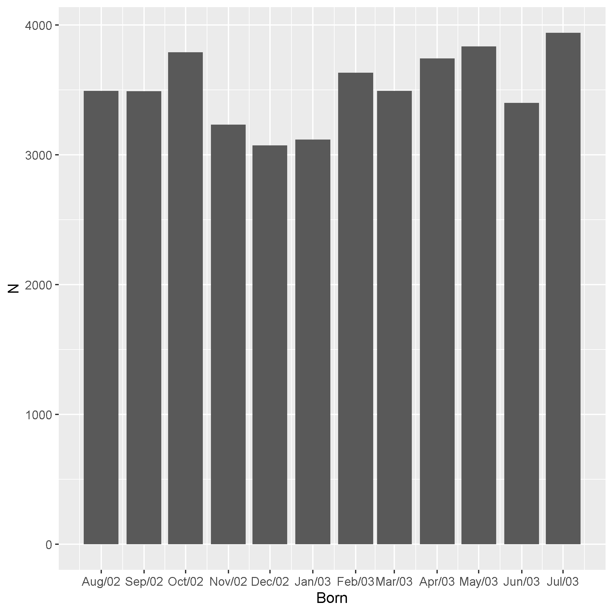
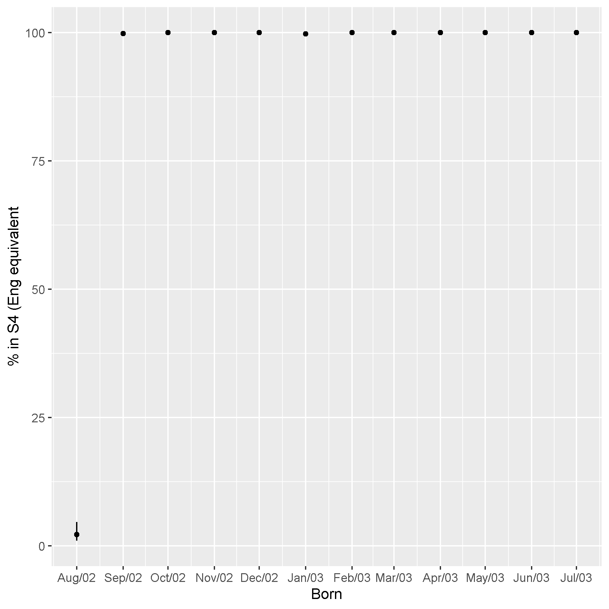
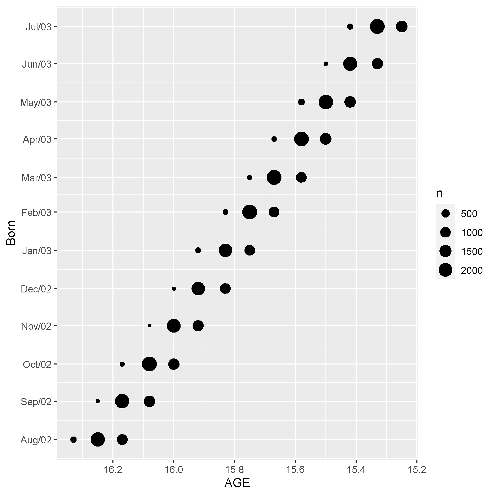
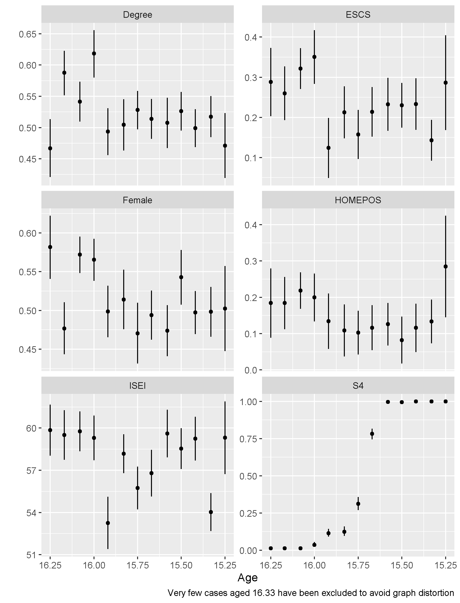

### Introduction

One potential role of the school system is to decrease inequalities in
the resources for learning between socioeconomically advantaged and
disadvantaged children. A young school starting age may help more
disadvantaged children by compensating for their more limited learning
resources at home. However there is danger with such an approach, as
there is evidence that being relatively young in a school year is a
disadvantage that could even offset any additional benefit of starting
school early. For more advantaged children when they start school or are
younger in the year may be less important as home resources can
compensate. For example, Suziedelytea and Zhu [@SUZIEDELYTE201576] found
that while early school starting age had positive impacts for cognitive
ability in young primary school children in Australia, particularly
those disadvantaged, it had negative impacts on social development
across the socioeconomic spectrum. In Scotland, children whose 4th
birthday is in February will normally start school that August while
those born March onward will start the following August. Pupils not aged
five by the August start can delay school a year with those born in
January and February who delay automatically entitled to an extra year
of nursery provision however this is discretionary for those born
September to December. While much work in Scotland has been conducted on
pupils social and emotional in Scotland in recent years (for an overview
see ) and some focus has been paid to school readiness and starting age,
most reports associations rather than a causal focus . This is a
significant gap as there is consistent evidence from natural experiment
studies in other countries that school starting age can affect the
likelihood of mental health problems and of a diagnosis of attention
deficit hyperactivity disorder (ADHD) [@Dee2018; @chen2015;
@ELDER2010641; @EVANS2010657; @SCHWANDT201672]. Here it is school
starting age affecting relative age within the school year that is the
studied mechanism. Most studies assess these affects by socioeconomic
background finding that impacts across the socioeconomic spectrum but
sometimes less so in those more advantaged [@Dee2018; @chen2015;
@ELDER2010641; @EVANS2010657]. A German study suggests that more
educated parents may be more likely to seek an ADHD diagnosis got their
young for year child but recognizes their evidence for this is weak
[@SCHWANDT201672]. Crawford et al. [-@crawford2014] outline the four
possible mechanisms through which age at starting school might impact
education and wellbeing outcomes: age at test, age of starting school,
length of schooling and relative age. As exams are generally taken at
the same time, age at test may be an important mechanism. By studying
test taken at the same age, they showed that most of the effect of
starting age on test performance in England was through age at test.
Analysis of England's PISA test scores (where the sample is age selected
so age at test is less of a factor) found little impact of school
starting cut-off, this was interpreted as an extra year of schooling
(length of schooling) having little effect [@Luyten2008; @benton2014].
It could also be driven by age of starting school or relative age
effects or a combination of all three offsetting. Luyten et al.
[-@Luyten2008] suggest that any positive effect of being in a higher
grade was greatest in more disadvantaged pupils. This raises the
possibility of a trade off between better test scores and worse mental
wellbeing especially for disadvantaged pupils

The Scottish Green Party has recently advocated a school starting age of
7 for academic and wellbeing reasons
<https://greens.scot/news/scottish-greens-kids-should-start-school-at-seven>
. The policy was informed by this commission review - [Working Paper \|
School Starting Age (SSA): A Brief Summary \| University of
Stirling](https://www.stir.ac.uk/research/hub/publication/1707844)

```{r setup, include=FALSE}
knitr::opts_chunk$set(echo = FALSE, eval = TRUE)
library(knitr)
library(tidyverse)
library(haven)
library(lubridate)
library(broom)
library(survey)
library(srvyr)
library(ggpubr)
library(rdrobust)
library(rddensity)
library(rdlocrand)
library(gtsummary)
library(gt)
library(flextable)
library(tableone)
library(mitools)

options(scipen=999)
  
datasort <- function(df, hisei) {df %>%
    select(CNTSTUID,
         CNTSCHID, 
         yeardob = ST003D03T,
         monthdob = ST003D02T,
         grade = ST001D01T,
         ESCS,
         HISEI={{hisei}},
         HISCED,
         MISCED,
         FISCED,
         BFMJ2,
         BMMJ1,
         HOMEPOS,
         SUBNATIO,
         AGE,
         STRATUM,
         sex=ST004D01T,
         repeat1=ST127Q01TA,
         repeat2=ST127Q02TA,
         repeat3=ST127Q03TA,
         starts_with("W_FST"),
         starts_with("PV"),
         BEINGBULLIED, WORKMAST, GFOFAIL,
         BELONG, SWBP, COMPETE, 
         EUDMO, EMOSUPS  ,PERCOOP,
         PERCOMP, MASTGOAL, RESILIENCE,
         ST184Q01HA, ST208Q01HA, ST208Q02HA, ST208Q04HA,
         ST182Q03HA, ST182Q04HA, ST182Q05HA,
         ST182Q06HA, ST188Q01HA, ST188Q02HA,
         ST188Q03HA, ST188Q06HA, ST188Q07HA,
         ST183Q01HA, ST183Q02HA, ST183Q03HA,
         ST185Q01HA, ST185Q02HA, ST185Q03HA,
         ST186Q05HA, ST186Q06HA, ST186Q07HA,
         ST186Q10HA, ST186Q09HA, ST186Q02HA,
         ST186Q01HA, ST186Q08HA, ST186Q03HA, 
         ST016Q01NA, ST181Q02HA, ST181Q03HA, ST181Q04HA, 
         ST038Q03NA, ST038Q04NA, ST038Q05NA, 
         ST038Q06NA, ST038Q07NA, ST038Q08NA, 
         ST205Q01HA, ST205Q02HA, ST205Q03HA, 
         ST205Q04HA, ST206Q01HA, ST206Q02HA,  
         ST206Q03HA, ST206Q04HA, ST123Q02NA, 
         ST123Q03NA, ST123Q04NA, ST034Q01TA, 
         ST034Q02TA, ST034Q03TA, ST034Q04TA,  
         ST034Q05TA, ST034Q06TA) %>%
    mutate(CNTSTUID = as.numeric(CNTSTUID),
    CNTSCHID= as.numeric(CNTSCHID),
    yeardob = as.numeric(yeardob),
    monthdob = as.numeric(monthdob),
    ESCS = as.numeric(ESCS),
    grade = as_factor(grade),
    HISEI = as.numeric(HISEI),
    HISCED = as_factor(HISCED),
    FISCED = as_factor(FISCED),
    MISCED = as_factor(MISCED),
    BFMJ2 = as.numeric(BFMJ2),
    BMMJ1 = as.numeric(BMMJ1),
    HOMEPOS = as.numeric(HOMEPOS),
    AGE=as.numeric(AGE),
    sex=as_factor(sex),
    STRATUM=as_factor(STRATUM),
    repeat1=as_factor(repeat1),
    repeat2=as_factor(repeat2),
    repeat3=as_factor(repeat3),
    across(starts_with("PV", ignore.case = FALSE), ~as.numeric(.x)),
    across(ends_with("HA", ignore.case = FALSE), ~as_factor(.x)),
    across(ends_with("NA", ignore.case = FALSE), ~as_factor(.x)),
    across(ends_with("TA", ignore.case = FALSE), ~as_factor(.x)),
    across(c(BEINGBULLIED, WORKMAST, GFOFAIL, BELONG, SWBP, COMPETE, 
         EUDMO, EMOSUPS,PERCOOP, PERCOMP, MASTGOAL, RESILIENCE), ~as.numeric(.x)),
    Lifesat=as.numeric(ST016Q01NA)) %>%
    mutate(across(starts_with("W_FST"), ~ as.numeric(.x))) %>%
    unite("dob", c(yeardob, monthdob), remove=FALSE, sep = "") %>%
    mutate(dob = ym(dob)) %>%
    mutate(across(where(is.factor), ~fct_drop(.x)))
}

filltar <- function(df=.data) {df %>%
  filter(grade == "Grade 12" | grade == "Grade 11" )  %>%
  filter(repeat1=="No, never") %>%
  filter(repeat2=="No, never") %>%
  filter(repeat3=="No, never") %>%
  mutate(grade2 = if_else(grade == "Grade 12", "S5", "S4")) %>%
  mutate(grade=fct_drop(grade)) 
}  


```

```{r data,  include=FALSE}

#2015 

#unzip("PUF_SPSS_COMBINED_CMB_STU_QQQ.zip")

#allpisadf2015 <- read_sav("CY6_MS_CMB_STU_QQQ.sav") 
#gbrpisadf2015 <-   allpisadf2015 %>%
#  filter(CNTRYID==826) 

#remove(allpisadf2015)

#remove(allpisadf2015)
#gc() #free ram


#2018 
#unzip("SPSS_STU_QQQ.zip")
# scot
allpisadf2018 <- read_sav("STU/CY07_MSU_STU_QQQ.sav") 
scotpisadf2018 <-   allpisadf2018 %>%
  filter(SUBNATIO=="8262000")   


engpisadf2018 <-   allpisadf2018 %>%
  filter(CNTRYID==826) %>%
  separate(STRATUM, c(NA, "STRATUM"), sep=3) %>%
  filter(between(as.numeric(STRATUM), 1101, 1113))


#free ram
rm(allpisadf2018)
gc()


# https://www.oecd-ilibrary.org/sites/0a428b07-en/index.html?itemId=/content/component/0a428b07-en

# mum, father, highest education - MISCED, FISCED, HISCED

# fathers BFMJ2; mother’s BMMJ1; and the highest occupational status of parents HISEI
  
scotpisadf2018 <- datasort(scotpisadf2018, HISEI) %>%
  as_survey_rep(repweights=starts_with("W_FSTURWT"),
                           weights=W_FSTUWT, type="BRR")


engpisadf2018 <- datasort(engpisadf2018, HISEI) %>%
  as_survey_rep(repweights=starts_with("W_FSTURWT"),
                           weights=W_FSTUWT, type="BRR")


```

```{r tables, echo=FALSE, include=FALSE, warning=FALSE}


#Exclusions
#grade 10
ex1 <- scotpisadf2018 %>%
group_by(grade) %>%
summarise(n())
#repeat
ex2 <- scotpisadf2018 %>%
group_by(repeat1) %>%
summarise(n())

ex3 <- scotpisadf2018 %>%
group_by(repeat2) %>%
summarise(n())

ex4 <- scotpisadf2018 %>%
group_by(repeat3) %>%
summarise(n())
  


#tables
theme_gtsummary_compact()
svytable1 <- scotpisadf2018 %>%
  filltar() %>%
  tbl_svysummary(by=grade2,
  statistic = list(all_continuous() ~ "{mean} ({sd})",
                   all_categorical() ~"{p}%"),
  label=list(AGE ~ "Age",
             sex ~ "Sex",
             HOMEPOS ~ "Home possessions scale",
             HISEI ~ "Highest Occupation of parents (ISEI)"),
  missing="no",
  include=c(grade2, AGE, sex, ESCS, HISEI, HOMEPOS, HISCED)
  ) %>%
  add_n(statistic = "{p_miss}%",
        col_label="**% miss**") %>%
  add_overall()  %>%
  as_flex_table() %>%
  set_caption(caption = "Table 1: Student characteristics
              in Scotland PISA 2018 by grade.") %>%
  autofit() 
  
  

svytable2 <- scotpisadf2018 %>%
  filltar() %>%
  filter(dob >= ymd("2002_09_01") & dob <=ymd("2003_02_01")) %>%
  mutate(Defer=if_else(grade=="Grade 11", "Yes", "No")) %>%
  tbl_svysummary(by=Defer,
  type= AGE ~ "continuous",               
  statistic = list(all_continuous() ~ "{mean} ({sd})",
                   all_categorical() ~"{p}%"),
  label=list(AGE ~ "Age",
             sex ~ "Sex",
             HOMEPOS ~ "Home possessions scale",
             HISEI ~ "Highest Occupation of parents (ISEI)"),
  missing="no",
  include=c(Defer, AGE, sex, ESCS, HISEI, HOMEPOS, HISCED)
  ) %>%
  add_overall()   

svytable3 <- scotpisadf2018 %>%
  filltar() %>%
  filter(dob >= ymd("2003_01_01") & dob <=ymd("2003_02_01")) %>%
  mutate(Defer=if_else(grade=="Grade 11", "Yes", "No")) %>%
  tbl_svysummary(by=Defer,
  type= AGE ~ "continuous",               
  statistic = list(all_continuous() ~ "{mean} ({sd})",
                   all_categorical() ~"{p}%"),
  label=list(AGE ~ "Age",
             sex ~ "Sex",
             HOMEPOS ~ "Home possessions scale",
             HISEI ~ "Highest Occupation of parents (ISEI)"),
  missing="no",
  include=c(Defer, AGE, sex, ESCS, HISEI, HOMEPOS, HISCED)
  ) %>%
  add_overall()   

svytable4 <- scotpisadf2018 %>%
  filltar() %>%
  filter(dob >= ymd("2003_02_01") & dob <=ymd("2003_03_01")) %>%
  mutate(month=if_else(dob==ymd("2003_02_01"), "Feb", "March")) %>%
  tbl_svysummary(by=month,
  type= AGE ~ "continuous",               
  statistic = list(all_continuous() ~ "{mean} ({sd})",
                   all_categorical() ~"{p}%"),
  label=list(AGE ~ "Age",
             sex ~ "Sex",
             HOMEPOS ~ "Home possessions scale",
             HISEI ~ "Highest Occupation of parents (ISEI)"),
  missing="no",
  include=c(month, AGE, sex, ESCS, HISEI, HOMEPOS, HISCED)
  )  %>%
  as_flex_table() %>%
  set_caption(caption = "Table 2 Student characteristics by month at cut off") %>%
  autofit() 

svytable4_SD <- scotpisadf2018 %>%
  filltar() %>%
  filter(dob >= ymd("2003_02_01") & dob <=ymd("2003_03_01")) %>%
  mutate(month=if_else(dob==ymd("2003_02_01"), "Feb", "March")) %>%
  mutate(a=HISCED=="None", b=HISCED=="ISCED 1", c=HISCED=="ISCED 2",
         d=HISCED=="ISCED 3B, C", e=HISCED=="ISCED 3A, ISCED 4",
         f=HISCED=="ISCED 5B", g=HISCED=="ISCED 5A, 6") %>%
  svyCreateTableOne(c("AGE", "sex", "ESCS", "HISEI", "HOMEPOS", "HISCED", "a",
                      "b", "c", "d", "e", "f", "g"),
                    strata="month", data=., smd=TRUE)

  svytable4_SD <- print(svytable4_SD, smd=TRUE)          


svytable5 <- scotpisadf2018 %>%
  filltar() %>%
  filter(dob >= ymd("2003_02_01") & dob <=ymd("2003_03_01")) %>%
  mutate(month=if_else(dob==ymd("2003_02_01"), "Feb", "March")) %>%
  mutate(month_grade=interaction(grade2, month, sep=" ")) %>%
  filter(month_grade!="S5 March") %>%
  mutate(month_grade=fct_drop(month_grade)) %>%
  tbl_svysummary(by=month_grade,
  type= AGE ~ "continuous",               
  statistic = list(all_continuous() ~ "{mean} ({sd})",
                   all_categorical() ~"{p}%"),
  label=list(AGE ~ "Age",
             sex ~ "Sex",
             HOMEPOS ~ "Home possessions scale",
             HISEI ~ "Highest Occupation of parents (ISEI)"),
  missing="no",
  include=c(month_grade, AGE, sex, ESCS, HISEI, HOMEPOS, HISCED)
  )  %>%
  as_flex_table() %>%
  set_caption(caption = "Table 3 Student characteristics
              by grade and month at cut off") %>%
  autofit()   

 svyfig1 <- scotpisadf2018 %>%
   filltar() %>%
  group_by(dob) %>%
  summarise(mgrade11 = survey_mean(grade=="Grade 11", vartype=c("ci"), proportion = TRUE, na.rm=TRUE)) %>%
  ggplot(aes(x=dob, y=mgrade11*100, 
             ymin=mgrade11_low*100, ymax=mgrade11_upp*100)) +
  geom_point() +
  geom_linerange() +
  scale_x_date(date_labels = "%b/%y", date_breaks = "month") +
  labs(x="Born",
       y="% in S4")
 ggsave("svyfig1.png", width=16, height=16, units="cm")
 
 
  svyfig1eng <- engpisadf2018 %>%
   filltar() %>%
  group_by(dob) %>%
  summarise(mgrade11 = survey_mean(grade=="Grade 11", vartype=c("ci"), proportion = TRUE, na.rm=TRUE)) %>%
  ggplot(aes(x=dob, y=mgrade11*100, 
             ymin=mgrade11_low*100, ymax=mgrade11_upp*100)) +
  geom_point() +
  geom_linerange() +
  scale_x_date(date_labels = "%b/%y", date_breaks = "month") +
  labs(x="Born",
       y="% in S4 (Eng equivalent")
 ggsave("svyfig1eng.png", width=16, height=16, units="cm")
 
 
 dob2 <- scotpisadf2018 %>%
  filltar() %>%
  mutate(dob2=as.period(interval(ymd("2003-03-01"),dob))) %>%
  mutate(dob2=as.numeric(dob2, "months")) %>%
  mutate(dob2=if_else(dob2>=0, dob2+1, dob2)) %>%
  select(dob2)

density_result <-  rdwinselect(dob2$variables[["dob2"]], wmin=1, nwindows=1)


 svyfig2 <- scotpisadf2018 %>%
   filltar() %>%
  group_by(dob) %>%
   survey_count() %>%
   ggplot(aes(x=dob, y=n)) +
   geom_col() +
   scale_x_date(date_labels = "%b/%y", date_breaks = "month") +
   labs(x="Born",
       y="N")
   ggsave("svyfig2.png", width=16, height=16, units="cm")
 
 


svyfig3 <- scotpisadf2018 %>%
   filltar() %>%
  group_by(AGE, dob) %>%
   survey_tally() %>%
   ggplot(aes(x=AGE, y=dob, size=n)) +
   geom_point() +
   scale_x_reverse() +
   scale_y_date(date_labels = "%b/%y", date_breaks = "month") +
   labs(y="Born",
        X="Age") +
  ggsave("svyfig3.png", width=16, height=16, units="cm")

 
  
svyfig4 <- scotpisadf2018 %>%
   filltar() %>%
  filter(AGE<16.33) %>%
  group_by(AGE) %>%
  summarise(S4 = survey_mean(grade=="Grade 11", vartype=c("ci"), 
                                  proportion = TRUE, na.rm=TRUE),
            ISEI = survey_mean(HISEI, vartype=c("ci"), na.rm=TRUE),
            ESCS = survey_mean(ESCS, vartype=c("ci"), na.rm=TRUE),
            HOMEPOS = survey_mean(HOMEPOS, vartype=c("ci"), na.rm=TRUE),
            Female = survey_mean(sex=="Female", vartype=c("ci"), 
                              proportion = TRUE, na.rm=TRUE),
            Degree = survey_mean(HISCED=="ISCED 5A, 6", vartype=c("ci"), 
                              proportion = TRUE, na.rm=TRUE)) %>%
  pivot_longer(cols=-AGE,names_to="var", values_to = "count") %>%
  separate(var, c("var", "stat")) %>%
  mutate(stat=if_else(is.na(stat), "mean", stat)) %>%
  pivot_wider(names_from = "stat", values_from = count) %>%
  ggplot(aes(x=AGE, y=mean, 
             ymin=low, ymax=upp)) +
  geom_point() +
  geom_linerange() +
    scale_x_reverse() +
  facet_wrap(vars(var), scales = "free_y", nrow = 3, ncol=2) +
  labs(y="",
       x="Age",
       caption="Very few cases aged 16.33 have been excluded to avoid graph distortion")
ggsave("svyfig4.png", width=16, height=21, units="cm")

 


 
 
 
 

fsvytable6 <- function(sw) {scotpisadf2018 %>%
  filltar() %>%
  mutate("Learning goals"=MASTGOAL, "Motivation to master tasks"=WORKMAST, Resilience=RESILIENCE, "Fear of failure"=GFOFAIL, "Meaning in life"=EUDMO, "Positive feelings"=SWBP, "Life satisfaction"=Lifesat, "Attitudes to competition"= COMPETE, "Exposure to bullying"=BEINGBULLIED, "Student competition"=PERCOMP, "Student co-operation"=PERCOOP, "Parents' emotional support"=EMOSUPS, "Sense of belonging"=BELONG) %>%
tbl_svysummary(
  statistic = list(all_continuous() ~ "{mean} ({sd})",
                   all_categorical() ~"{p}%"),
  missing="no",
  include=sw) %>%
  modify_header(label ~ "**Outcomes**") %>%
  add_n(statistic = "{p_miss}%",
        col_label="**% miss")
}  

flexmygt <- function(gt, cap) {
  as_flex_table(gt) %>%
  set_caption(caption = cap) %>%
  autofit() 
}
svytable6a <- fsvytable6(sw=c("ST184Q01HA"))
svytable6b <- fsvytable6(sw=c("Learning goals", "Motivation to master tasks", "Resilience", "Fear of failure", "Meaning in life", "Positive feelings", "Life satisfaction","Attitudes to competition"))
svytable6c <- fsvytable6(sw=c("Exposure to bullying", "Student competition", "Student co-operation", "Parents' emotional support", "Sense of belonging"))

svytable6 <- tbl_stack(list(svytable6a, svytable6b, svytable6c),
              group_header = c("Cognitive", "Psychological", "Social")) %>%
              modify_footnote(all_stat_cols() ~ NA)


svytable6 <- flexmygt(svytable6, "Table 4 Wellbeing Outcomes")

svytable6_cog <- fsvytable6(starts_with("ST184Q")) %>%
  flexmygt("Table A1 Cognitive wellbeing")
  
svytable6_learn <- fsvytable6(starts_with("ST208Q")) %>%
  flexmygt("Table A2 Learning goals")
svytable6_motiv <- fsvytable6(starts_with("ST182Q")) %>%
  flexmygt("Table A3 Motivation to master tasks") 
svytable6_resil <- fsvytable6(starts_with("ST188Q")) %>%
  flexmygt("Table A4 Resilience (or self-efficacy)") 
svytable6_fail <- fsvytable6(starts_with("ST183Q")) %>% 
  flexmygt("Table A5 Fear of failure")
svytable6_mean <- fsvytable6(starts_with("ST185Q")) %>%
  flexmygt("Table A6 Meaning in life")
svytable6_pfeel <- fsvytable6(starts_with("ST186Q")) %>% 
  flexmygt("Table A7 Positive feelings")
svytable6_satis <- fsvytable6(starts_with("Life satisfaction")) %>%
  flexmygt("Table A8 Life satisfaction")
svytable6_comp <-  fsvytable6(starts_with("ST181Q")) %>% 
  flexmygt("Table A9 Attitudes to competition")
svytable6_bully <-  fsvytable6(starts_with("ST038Q")) %>% 
  flexmygt("Table A10 Exposure to bullying")
svytable6_stucomp <- fsvytable6(starts_with("ST205Q")) %>% 
  flexmygt("Table A11 Student competition")
svytable6_coop <-  fsvytable6(starts_with("ST206Q")) %>%  
  flexmygt("Table A12 Student co-operation")
svytable6_supp <- fsvytable6(starts_with("ST123Q")) %>%  
  flexmygt("Table A13 Parents' emotional support")
svytable6_belong <- fsvytable6(starts_with("ST034Q")) %>%  
  flexmygt("Table A14 Sense of belonging")


#Based on http://asdfree.com/program-for-international-student-assessment-pisa.html
pvmeanandci <- function(test) {
v1 <- scotpisadf2018 %>%
  select(ends_with(test)) 
m1 <- names(v1$variables) %>%
        map(~scotpisadf2018 %>%
        filltar() %>%
        rename(res=.data[[.x]])) %>%
  map(~svymean(~res, design=.x)) %>%
  MIcombine() 
  ci <- confint(m1)
  tibble("Mean" = round(m1$coefficients[["res"]]),
         "LCI" = round(ci[1,1]),
         "UCI" = round(ci[1,2]))
}

math <- pvmeanandci("MATH")
read <- pvmeanandci("READ")
science <- pvmeanandci("SCIE")
  
svytable7 <- bind_rows("Math"=math, 
                       "Reading"=read, 
                       "Science"=science, 
                        .id="Subject") %>%
            gt(rowname_col="Subject") %>%
       cols_label(
   Mean = md("**Mean**"),
    LCI = md("**Lower CI**"),
    UCI = md("**Upper CI**")
  ) %>%
  tab_style(style=cell_text(size="small"),
            locations=cells_body()) %>%
  tab_header(title = "Table 18 PISA assessment scores") 

  
 
  


    
```

### Method

#### Data

We are using The Programme for International Student Assessment (PISA)
2018 data for Scotland (and England as a comparison). PISA surveys 15
years old students (with some leeway so includes some aged 16 ) in
formal schooling in countries across the OECD using a standard framework
with local adaptations. The core aim is to assess and compare countries
on students' literacy in reading, maths and science. School based
fieldwork in Scotland between 8th October and 14th December 2018. A two
stage stratified sample was employed, schools and then students in
schools were sampled (for details see [@sg2018]). Scotland had an 81%
participation rate meeting the 80% target of the OECD. Surveys were
computer administered and in addition to assessing the core literacies
students completed a questionnaire covering their socio-economic
background and their wellbeing which we draw on in this study as well.
The Scottish questionnaires are available to download at
[[http://www.oecd.org/pisa/publications/UK%20(Scotland).zip]](http://www.oecd.org/pisa/publications/UK%20(Scotland).zip)[(http://www.oecd.org/pisa/publications/UK%20(Scotland).zip)](http://www.oecd.org/pisa/publications/UK%20(Scotland).zip)
. As PISA is aimed at a specific age, it can cover a number of school
years (grades in PISA terminology) . In Scotland the sample was split
between S4 and S5 pupils (PISA grades 11 and 12) , the few in other
years are excluded in our analysis as are any pupils who said they had
repeated a year. These exclusions reduced the sample from 2998 pupils to
2802 pupils. Given the complex survey design all analysis incorporates
replication weights and student weights. The weights are scaled to the
population rather than the sample hence why in the following the sample
size is 42,243. Table 1 describes the sample overall and by school year.
We include four measures of socio-economic position. PISA's summary
scale is the index of economic, social and cultural status (ESCS). It is
based on three indices, parental education (International Standard
Classification of Education[)]{.ul}, parental occupation (International
Socio-Economic Index) and PISA's home possessions scale. There is some
imputation for missing data when calculating the ESCS.

```{r table 1, include=TRUE, message=FALSE}
knit_print(svytable1)

```

#### Design

As illustrated in Figure 1 Scotland's February / March cut off leads to
a large jump in the probability of being in S4 as opposed to S5. This
allows a regression discontinuity design. Figure 2 shows the
distribution of month of birth and we ran a test to see if there was
evidence of bunching in the distribution of month of birth at the cut
point , there does not seem to be
(p=`r round(density_result$results[[3]], 2)`).

```{r fig1, echo=FALSE, fig.cap="Figure 1 - The probability of being in S4 by date of birth."}
include_graphics("svyfig1.png")

```

```{r fig2, echo=FALSE, fig.cap="Figure 2 - The distribution of month of birth"}


```

We will compare those in S5 to S4 in the month either side of the
cut-off ,in other words those born in February and March. Table 2 shows
that those deferring are more likely to be male and (slightly) more
advantaged. Because deferral is not random we will use month of birth as
an instrument for school year, a fuzzy regression discontinuity.
Instrumental analysis has the following three assumptions.

```{r table 2, include=TRUE, message=FALSE}

knit_print(svytable5)


```

1.  Being either side of the cut point is a cause of the school year you
    are in.

This is the national rule on entry and its effect is illustrated in
Figure 1.

2.  Being either side of the cut point only affects our outcomes via
    school year.

One potential violation of this is through age as by definition those
born in February are a month older. One argument is that as school exams
are not taken at the same age that February born, being a year ahead,
will take their exams at a younger age. Hence age is a mechanism through
which school year impacts outcomes and so this differential is not a
violation of this assumption. As a comparison we will run the same
analysis for England where (see Figure 3) the cut date is in August and
all pupils in PISA are in the same year.

3.  Being either side of the cut and the outcomes do not share common
    cause.

Although there is some evidence that season of birth might be affected
by socio-economic position, month to month variation seems less likely.
As Table 4 shows those born in February are very similar in
socio-economic profile to those born in March with some minor
differences in education background.

```{r fig3, echo=FALSE, fig.cap="Figure 3 - The probability of being in S4 equivalent in England  by date of birth"}


```

```{r table 3, include=TRUE, message=FALSE}


knit_print(svytable4)


```

\newpage

#### Analysis

We will use a version of instrumental variable analysis that accounts
for the survey design. As there are large number of outcomes we shall be
cautious to not over emphasise single "significant" results but take a
holistic approach to assessing whether their is a consistent pattern of
results. Additionally our analysis may be underpowered so we will be
cautious in claiming no effect when results are imprecise. Although
missing data is relatively low we will attempt to adjust for this in
sensitivity analysis using inverse probability weighting

To test for effect modification by socio-economic background we shall
interact grade with our socio-economic variables. We will see whether
comparing the extremes of advantage and disadvantage are important by
using quartiles of the continuous socio-economic measures.

##### Sensitivity analysis

-   Extend analysis to include January born pupils in the control group.

-   Use age as test as the forcing variable instead of month of birth.
    It is not collinear with month of birth (see Figure 4) as fieldwork
    for PISA happens over a 3 month period but does jump at the cut
    point. This allows us to remove age differences (as in effect we are
    assessing the impact for someone the same age) to assess whether it
    is the main driver of any differences observed in the main analysis.
    Figure 5 shows the jump in the probability of being in S4 by age at test and 
    also that their appear to be no systematic differences across the
    socio-economic background variables by age.

```{r fig4, echo=FALSE, fig.cap="Figure 4 - Age at test and month of birth"}



```

```{r fig5, echo=FALSE, fig.cap="Figure 5 - S4 probability and confounder distribution by age at test."}



```


#### Outcomes

##### Wellbeing

We will use the PISA framework of wellbeing that covers three main
dimensions (cognitive, psychological and social) [@govorova2020]. We
focus on 14 scales in these domains. These scales, apart from two single
question scales, were constructed from a number of questions (see
appendix each question) by the PISA study using item response theory
(IRT) scaling. The scales have a mean 0 and a standard deviation of 1
across the OECD. Negative scores mean that the score was below the OECD
average but could be based on positive responses to the scales
questions. The PISA technical report contains full details of the IRT
scaling .<http://www.oecd.org/pisa/data/pisa2018technicalreport/>

Table 4 sets out the domains and their scales while the specific
questions are in Tables A1 to A14 in the appendix.

```{r table 4, include=TRUE, message=FALSE}

knit_print(svytable6)

```

#### Appendix

**Cognitive**

```{r table A1, include=TRUE, message=FALSE}

knit_print(svytable6_cog)

```

**Psychological**

Students were asked about the following eight domains of psychological
well being most of which contain a number of questions

-   Learning goals

```{r table A2, include=TRUE, message=FALSE}

knit_print(svytable6_learn)

```

-   Motivation to master tasks

```{r table A3, include=TRUE, message=FALSE}

knit_print(svytable6_motiv)

```

-   Resilience (or self-efficacy)

```{r table A4, include=TRUE, message=FALSE}

knit_print(svytable6_resil)

```

-   Fear of failure

```{r table A5, include=TRUE, message=FALSE}

knit_print(svytable6_fail)

```

-   Meaning in life

```{r table A6, include=TRUE, message=FALSE}

knit_print(svytable6_mean)

```

-   Positive feelings

```{r table A7, include=TRUE, message=FALSE}

knit_print(svytable6_pfeel)

```

-   Life satisfaction

```{r table A8, include=TRUE, message=FALSE}

knit_print(svytable6_satis)

```

-   Attitudes to competition

```{r table A9, include=TRUE, message=FALSE}

knit_print(svytable6_comp)

```

**Social**

-   Exposure to bullying

```{r table A10, include=TRUE, message=FALSE}

knit_print(svytable6_bully)

```

-   Student competition

```{r table A11, include=TRUE, message=FALSE}

knit_print(svytable6_stucomp)

```

-   Student co-operation

```{r table A12, include=TRUE, message=FALSE}

knit_print(svytable6_coop)

```

-   Parents' emotional support

```{r table A13, include=TRUE, message=FALSE}

knit_print(svytable6_supp)

```

-   Sense of belonging scale

```{r table A14, include=TRUE, message=FALSE}

knit_print(svytable6_belong)

```

#### References
